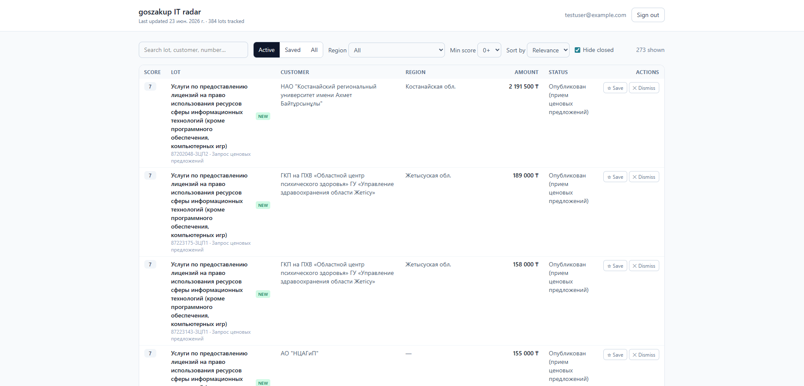

# goszakup-it-radar

A personal dashboard that screens Kazakhstan government procurement
([goszakup.gov.kz](https://www.goszakup.gov.kz)) for **open IT-related lots** you can bid on.

**Live demo:** [goszakup-radar.vercel.app](https://goszakup-radar.vercel.app) — private by
design (single account, sign-in only); see [screenshots](#screenshots).

**Stack:** React · TypeScript · Tailwind · Supabase (Postgres + Auth + RLS) · Node + Cheerio
scraper · GitHub Actions · Vercel

## Why

The official portal has thousands of active lots across every category. This tool
filters them down to IT work (software, web, information systems, support,
hardware), ranks by relevance, tracks what's new, and lets you save or dismiss
lots — so screening takes minutes instead of hours.

## Features

- Scrapes goszakup's lot search for **open IT lots** and ranks each by a relevance score
- **Region** filter/sort (derived from the customer org), **min-score** filter, full-text search
- Hides **closed** lots (no longer in the latest scrape) and flags brand-**new** ones
- Per-user **save / dismiss / notes**, protected by Row-Level Security
- **Scheduled** scrape every 8 h via GitHub Actions, with `first_seen`/`last_seen` dedup
- Optional **Telegram alerts** for new high-relevance lots

## Screenshots

<!-- The live demo is login-gated, so add a screenshot for reviewers:
     save a dashboard capture as docs/dashboard.png and uncomment the line below. -->
<!--  -->

_Coming soon — drop a dashboard screenshot in `docs/` and link it here._

## Architecture

```
GitHub Actions (cron, a few times/day)
        │  runs the scraper
        ▼
goszakup /search/lots ──parse HTML──► filter IT ──score──► upsert ──► Supabase (Postgres)
                                                                          │ Row-Level Security
                React + TS + Tailwind dashboard (Vercel) ──supabase-js────┘
```

- **Scraper** — Node + TypeScript + Cheerio. Pushes IT keyword queries to the
  site's `filter[name]` search (restricted to open statuses), pages through
  results, de-duplicates by lot number, and scores each lot for relevance.
- **Database / Auth / Storage** — Supabase. `lots` is shared and scraper-owned;
  `user_lot_state` is per-user (saved / dismissed / notes) behind RLS.
- **Scheduler** — GitHub Actions cron writes fresh lots to Supabase.
- **Frontend** — React reads from Supabase directly; no custom API server needed
  for the read-only dashboard.

## Status

- [x] **Phase 1** — Scraper core: fetch, parse, IT-filter, relevance score, CLI output
- [x] **Phase 2** — Persist to Supabase with dedup (`first_seen` / `last_seen`)
- [x] **Phase 3** — React dashboard (auth, filter, sort, save/dismiss, "new" badges)
- [x] **Phase 4** — GitHub Actions scheduled scrape
- [x] **Phase 5** — Deploy dashboard to Vercel
- [x] **Phase 6** — Telegram alerts for new high-relevance lots

## Dashboard — local usage

```bash
cd web
npm install
cp .env.example .env.local   # add VITE_SUPABASE_URL + VITE_SUPABASE_ANON_KEY
npm run dev
```

The UI is **sign-in only**; create your user in Supabase (Authentication → Users), or
temporarily enable sign-ups. Lots are read from Supabase (RLS limits access to
authenticated users); per-user save/dismiss/notes live in `user_lot_state`.

## Automation (GitHub Actions)

[`.github/workflows/scrape.yml`](.github/workflows/scrape.yml) runs the scraper
every 8 hours (and on demand via *Run workflow*). Add two **repository secrets**
under *Settings → Secrets and variables → Actions*:

- `SUPABASE_URL`
- `SUPABASE_SERVICE_ROLE_KEY`

The service-role key stays server-side in GitHub — it's never shipped to the browser.

## Deploy the dashboard (Vercel)

Import the repo at [vercel.com](https://vercel.com) and set:

- **Root Directory:** `web`
- **Framework Preset:** Vite (auto-detected; pinned in [`web/vercel.json`](web/vercel.json))
- **Environment Variables:** `VITE_SUPABASE_URL` and `VITE_SUPABASE_ANON_KEY`
  (the **anon** key — never the service-role key)

After the first deploy, add the Vercel URL to Supabase → Authentication → URL
Configuration → **Site URL**. The `rewrites` rule serves `index.html` for all
routes (SPA fallback).

## Telegram alerts (optional)

After each scrape, new lots scoring ≥ `ALERT_MIN_SCORE` (see
[`scraper/src/config.ts`](scraper/src/config.ts)) are sent to a Telegram chat as
one summary message. Disabled unless both env vars are set.

Setup:

1. Create a bot with [@BotFather](https://t.me/BotFather) → copy the **token**.
2. Put it in `scraper/.env` as `TELEGRAM_BOT_TOKEN`, open your bot, send it `/start`.
3. `cd scraper && npm run telegram:chatid` → copy the printed id into
   `TELEGRAM_CHAT_ID`.
4. `npm run telegram:test` → confirms a sample alert arrives.
5. Add both as **GitHub repository secrets** so the scheduled scrape can alert too.

## Security model

The scraper and the website are **fully decoupled**, which keeps the public
deployment from being able to do anything risky:

- **Polling runs only on GitHub Actions**, hitting goszakup from GitHub's IPs on a
  fixed schedule. The deployed dashboard has no code path that triggers a scrape,
  so a compromised frontend cannot make the app poll goszakup or expose your IP.
- **Write access is server-side only.** The `service_role` key (the only credential
  that can write to `lots`) lives in GitHub secrets and the local `.env` — never in
  the browser. The frontend ships the **anon key**, which RLS restricts to reads.
- **Single account.** New sign-ups are disabled in Supabase
  (Authentication → Providers → Email → "Allow new users to sign up" = off), so only
  the owner can log in. Per-user data in `user_lot_state` is RLS-scoped to `auth.uid()`.
- **Lots are private by default** — `lots` is readable only by authenticated users.
  Switch to a public read-only demo by adding an `anon` select policy if desired.

## Scraper — local usage

```bash
cd scraper
npm install
npm run scrape      # prints the top open IT lots to the console
```

Tuning lives in [`scraper/src/config.ts`](scraper/src/config.ts): open status
codes, the IT keyword set, relevance weights, page size, and request delay.
